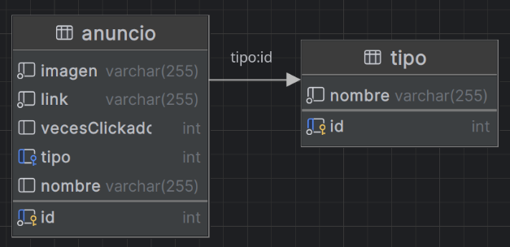

# 📢 API de Anuncios de CustomBlocks

La **API de Anuncios** es un servicio backend desarrollado para gestionar los anuncios en el juego **CustomBlocks**. Esta API permite almacenar, actualizar y recuperar anuncios relacionados con el juego, como promociones, noticias, o cualquier mensaje relevante para los jugadores.

---

## 🚀 Características Principales

- **Gestión de anuncios**: Crear, actualizar y eliminar anuncios.
- **Recuperación de anuncios**: Obtener anuncios activos para mostrarlos en el juego.
- **Conexión con el sistema de CustomBlocks**: Integración con el frontend del juego para mostrar anuncios a los jugadores.
- **Gestión en tiempo real**: Permite a los administradores modificar los anuncios rápidamente sin necesidad de reiniciar el sistema.

## 💾 Esquema

<div align="center">
  
</div>

## 🛠️ Instalación y Uso

### 1. **Clonar el Repositorio**
Para comenzar, clona este repositorio en tu máquina local:

```bash
git clone https://github.com/PrudenK/API_anuncios.git
cd API_anuncios
